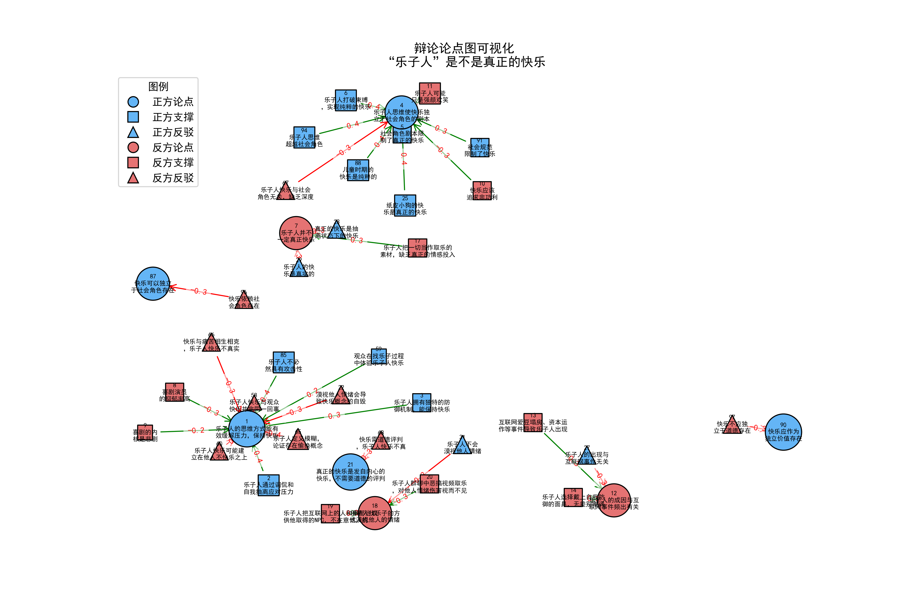

# 华语竞技辩论赛博评委项目：Cyber_Debate_Judge

>「 我觉得，辩论赛这种活动，就应该让DeepSeek来评。」

> 如果有用，欢迎 star ✨本项目。

## 功能

利用大语言模型对辩论赛进行建模、赛果判断和点评，生成可视化的交锋示意图。

## 程序简介

该程序借助大语言模型，利用图结构对辩论赛过程进行建模。尝试对我们评价一场辩论赛的指标（“证成度”“残留度”“论证效力”等）进行量化，从而让大语言模型清晰地理解赛场上的交锋点、攻防过程，成为真正没有心证的攻防裁，打造最适合华语辩论宝宝体质的赛博评委！

此外，该程序还可以生成比赛交锋的可视化「辩论地图」，清晰地对场上攻防进行可视化的聚类和追踪，帮助辩手学习和把握所谓「战场意识」。



## 原理

一场辩论赛的内容，大体上可以归结为三类：**「主论点」「论据」和「反驳」**。当然，目前流行的华语辩论框架中，还有「定义」「判准」等术语，这里我们一概作为论点处理。为了叙述方便，在下文中，我们将这三种内容一律称作「论点」。  

如果我们观察人类评委的手稿，会发现上面往往会有密密麻麻的箭头，标记出正方的A数据论证了B论点，反方提出了X逻辑反驳了正方的C论点。在数学上，我们可以用图结构，来对这些论点的交互进行建模。**每一个论点被编码为图的节点，而「支撑」「反驳」关系则被编码为图的边**。正如上文的图片，便是2024年新国辩中政法vs人大“乐子人是不是真正的快乐”的交锋过程的可视化图。

我们可以进一步对节点和边进行权重赋值，构造出加权图。用「初始论证效力」对主论点进行赋值，表示这个论点被提出、还未经过任何交锋时，在何种程度上可以证明持方。用「证成/反驳效力」对图的边进行赋值，表示一个论据可以在何种程度上支撑一个论点，一种反驳在何种程度上反驳一个论点。进一步地，考虑一个论点在交锋中受到的所有支持和反驳，可以计算出这个论点的**残留度**。

这样，大模型可以从一个标记了发言持方和环节的json文件中读取一整场辩论赛的文本，逐环节地处理辩论过程（模型往往有上下文长度限制，因此直接把一整场辩论赛的文本交给大模型是不明智的。这样也无法让模型理解场上的战场和交锋，只有把任务拆解，才能最大程度地发挥模型的效力），更新和维护一张同样以json格式存储的**论点拓扑图**。最终，我们用论点拓扑图中记录的节点和边的权重计算赛果，并交给大模型来生成最后的点评。这份论点拓扑图经过可视化处理后，就生成了上文中的可视化的**辩论地图**。

## 使用说明
1. 安装本项目的依赖：`pip install json,matplotlib,zhipuai,scipy,networkx,numpy`
1. 使用飞书妙记或者腾讯云录制等程序，对辩论赛的音频文本转文字。**（要求必须使用标注了说话人的语音转文字应用）**
2. 本项目使用的是**智谱清言**的API接口，你可以[在这里自行申请智谱清言的API密钥](https://bigmodel.cn/usercenter/proj-mgmt/apikeys)配置到“main.py”“录音转文字toJson.py”这两份python程序的开头。
3. 完成文件名和API密钥的配置后，运行“录音转文字toJson.py”，你会得到下面这样的json文件：

```json
[
    {
      "speaker": "说话人 1",
      "text": "下面有请正方一辩..."
    },
    {
      "speaker": "说话人 2",
      "text": "谢谢主席，大家好，我方认为..."
    },
    ...
]
```

4. 你需要手动对这份json文件做两项调整：
- **标注环节**：用中括号 [  ] 把每一个发言环节围起来。
- **标记正反方**：把正方的所有辩手的发言均标记为`Pro`，反方均标记为`Con`，主席标记为`Chair`。完成后的json文件应该是这样的：
```json
[
  [
    {
      "speaker": "Chair",
      "text": "首先是陈词一环节，有请正方一辩。"
    },
    {
      "speaker": "Pro",
      "text": "好，谢谢主席。各位好..."
    }
  ],
  [
    {
      "speaker": "Chair",
      "text": "感谢正方一辩，有请反方四辩对正方一辩进行质询一环节"
    },
    {
      "speaker": "Con",
      "text": "同学你好，你方说..."
    },
    {
      "speaker": "Pro",
      "text": "你好..."
    },
    ...
  ],
  ...
]
```
- 你也可以直接用“测试用”文件夹中已经调整好的三个json文件来运行测试。


5. 完成这两项调整之后，我们就可以运行主程序了！在“main.py”程序的开头配置好**你的API密钥、比赛辩题、比赛json路径、立论轮次（一般为`[1,3]`）**，然后点击运行。如果配置无误，你会看到这样的输出：

```
==== 开始第 1 轮辩论 ====
Round 1: 添加新论点 node_1（Pro）：拐卖妇女儿童应实施‘买卖同罪’，以实现罪行相适应，初始重要性：1.2
Round 1: 添加新论点 node_2（Pro）：买卖同罪具备法理上的正当性，符合刑罚的两大功能，初始重要性：1.0
Round 1: 添加新论点 node_3（Pro）：买卖同罪的预防效果更好，有助于遏制犯罪，初始重要性：0.9

==== 开始第 2 轮辩论 ====
Round 2: Con 的更新 node_4 被识别为 attack，针对 node_1：买卖同罪会导致收买罪的刑期过重，影响值：-0.3
Round 2: Pro 的更新 node_5 被识别为 support，针对 node_1：收买罪刑期应与拐卖罪一致，以体现罪行相适应，影响值：0.4
Round 2: Con 的更新 node_6 被识别为 attack，针对 node_2：买卖同罪不符合刑罚的两大功能，影响值：-0.2

...
```

6. 程序依次处理完所有轮次的文本之后，会清洗相似项、统计得分、生成可视化图。大功告成！

## 后记
这是一个新手的练习性质的项目。从产生点子到完成初版，花了大约8小时来完成，后续又用了几天进行优化和调试。做这个项目，是因为我相信能真正上场打比赛的AI辩手（会质询可打断能对辩会辩棍技术动作​会设计战场和辩论进程的AI辩手）所需的所有的技术都已经成熟，它的问世不会遥远。而赛博评委，很可能是赛博辩手所需要的前置技术：设想AI可以在比赛过程中实时判断每个论点的证成度、残留度，在脑海中出现一张辩论地图，从而分清轻重缓急，平衡好推论和拆论，很难想象还有哪个攻防裁还会把票投给人类。我并不期待也不认为这种东西会替代人类评委。如果将来中学生大学生要对着AI唇枪舌剑，怎么想都会是一种侮辱。在赛博辩手出现的前夜，在属于辩论圈的、如同AlphaGo战胜李世石的那个历史时刻之前，我觉得我们人类打辩论的不得不提前做好反思，这项活动留给人类的、最独特的退无可退的意义是什么。这个问题大概要提上辩论圈的议程了。

这是本项目试图发起的思考和讨论。